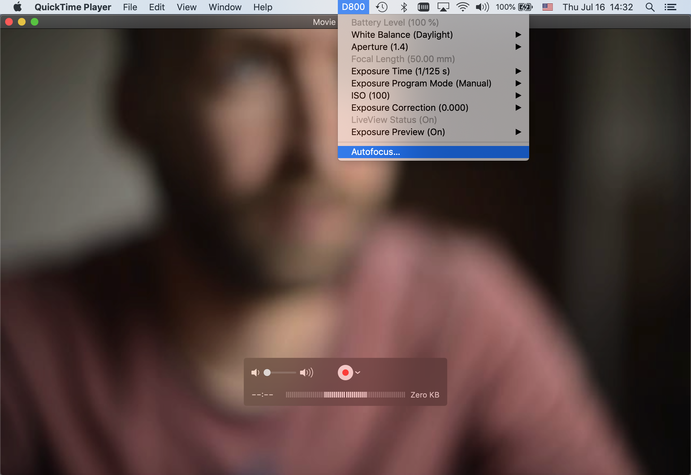
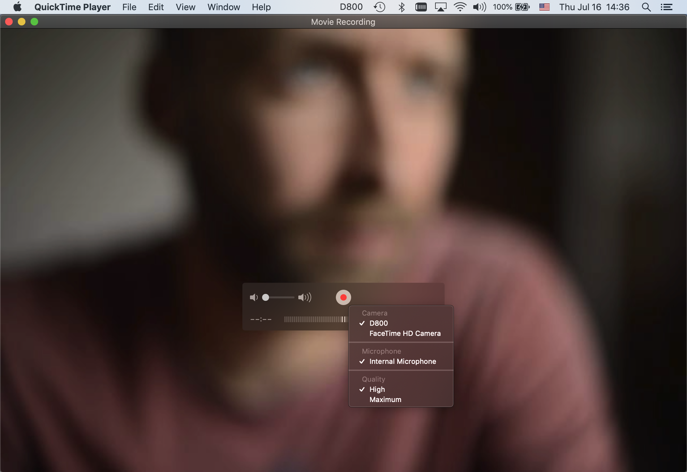

#  PTP Webcam – DSLR Live View Video and Webcam Control

Large sensor digital still cameras can provide an exceptionally good image for video conferencing, compared to most built-in web cameras.

This is a plugin to make compatible digital cameras available as webcams in video calls, for example in Zoom or Skype on macOS. It also allows control of camera settings from the computer to adjust exposure parameters and focus.

The project consists of a CoreMediaIO DAL plugin, and a preview app to test functionality.

**Note:** only video is currently captured, no audio.

## Installation

### System Requirements

A compatible camera connected via USB to a Mac running macOS / OS X 10.12 through 10.15. 

### Binary Packages

Download and install the latest release from the [PTP Webcam Homepage](https://ptpwebcam.org).

Installer packages for older releases are available from the [Releases page](https://github.com/dognotdog/ptpwebcam/releases) of this project. 

### Building from Source

If you want to build from source, you need Xcode. For each target you need to manually change the TeamId to match your developer certificate.

The build process will automatically copy the plugin into `/Library/CoreMediaIO/Plug-Ins/DAL` to be available to the system.
Therefore you need to grant your user read-write to the following folders
- `/Library/CoreMediaIO/Plug-Ins/DAL/`
- `/Library/LaunchAgents/`
- `/Library/LaunchDaemons/`

Two build phases require to sudo commands, therefore you will need to setup your KeyChain with an `xcode_bash` password. You can follow instructions [here](https://forum.juce.com/t/build-script-for-automatically-moving-built-aus-into-components-folder-xcode/13112).
You also need to replace `dog` by your username in two places
- `askpass.sh`
- Build Phase _load launchd_ for `org.ptpwebcam.ptpwebcamdalplugin`

However, apps with _Library Validation_ enabled will need to have codesigning disabled to be able to access the plugin, see the **Known Issues** section below.

### Testing the Installation

Opening _Quicktime Player_ and creating a _New Movie Recording_ via `File -> New Movie Recording`, then selecting the camera source can be used to verify functionality. The camera needs to be plugged in and turned on, and it might take a few seconds to show up.

_Quicktime Player_ works because it has _Library Validation_ disabled out-of-the-box, unlike eg. _Photo Booth_, which has the capability to use different video sources, but is prevented from doing so because _Library Validation_ is enabled.

**Note:** video quality in the camera selection drop-down menu must be set to **Maximum** to get a video resolution higher than 640x480.

#### What it should look like

If the camera is connected, a status bar item with the camera's model number should appear and can be used to change settings.

 

### Uninstalling

Delete the following files and reboot to uninstall PTP Webcam:
```
/Library/CoreMediaIO/Plug-Ins/DAL/PTPWebcamDALPlugin.plugin
/Library/LaunchDaemons/org.ptpwebcam.PtpWebcamAssistant.plist
/Library/LaunchAgents/org.ptpwebcam.PtpWebcamAgent.plist
```

## Supported Cameras over USB

The supported cameras and their capabilities are listed in [CAMERAS.md](CAMERAS.md). Cameras from Canon, Nikon, and Sony are currently supported.

Additionally many UVC (USB Video Class) cameras can also be controlled.
 
## Known Issues
 
### Library Validation
 
macOS applications that have library validation enabled cannot load DAL plugins that have not been signed or signed by another developer. Therefore, some popular video conferencing tools do not work out of the box.
 
The easiest way to workaround is to remove the signature for the offending applications, but note that this might be affected by security settings on your system, and might require to relax security settings.

Status for an unknown app can be checked via `codesign -d --entitlements :- /Path/to/App` and if any entitlements show up, `com.apple.security.cs.disable-library-validation` needs to be among them: 
```
<key>com.apple.security.cs.disable-library-validation</key>
<true/>
```
If it is not, codesigning has to be removed from the app and potentially its helper apps. 

#### References
 
https://stackoverflow.com/a/62456259/4296447
 
#### Zoom workaround
 
 Zoom version 5.1.1 and newer no longer has library validation issues. For older versions that do not show the plugin codesigning can be disabled:
`codesign --remove-signature /Applications/zoom.us.app`
 
#### Skype workaround

Skype version 8.62.0.85 and newer no longer has library validation issues, and work out of the box.
 
Older versions of Skype have several helper apps inside its application bundle that might need code signing disabled. 

```
codesign --remove-signature /Applications/Skype.app
cd /Applications/Skype.app/Contents/Frameworks
codesign --remove-signature Skype\ Helper.app
codesign --remove-signature Skype\ Helper\ \(Renderer\).app
```
Additional helpers might be named differently in different Skype versions.

#### Google Chrome workaround

```
codesign --remove-signature /Applications/Google\ Chrome.app
codesign --remove-signature /Applications/Google\ Chrome.app/Contents/Frameworks/Google\ Chrome\ Framework.framework/Helpers/Google\ Chrome\ Helper.app
codesign --remove-signature /Applications/Google\ Chrome.app/Contents/Frameworks/Google\ Chrome\ Framework.framework/Helpers/Google\ Chrome\ Helper\ \(GPU\).app
codesign --remove-signature /Applications/Google\ Chrome.app/Contents/Frameworks/Google\ Chrome\ Framework.framework/Helpers/Google\ Chrome\ Helper\ \(Plugin\).app
```
#### Brave workaround

```
codesign --remove-signature /Applications/Brave\ Browser.app
codesign --remove-signature /Applications/Brave\ Browser.app/Contents/Frameworks/Brave\ Browser\ Framework.framework/Helpers/Brave\ Browser\ Helper.app
codesign --remove-signature /Applications/Brave\ Browser.app/Contents/Frameworks/Brave\ Browser\ Framework.framework/Helpers/Brave\ Browser\ Helper\ \(GPU\).app
codesign --remove-signature /Applications/Brave\ Browser.app/Contents/Frameworks/Brave\ Browser\ Framework.framework/Helpers/Brave\ Browser\ Helper\ \(Plugin\).app

```

#### Microsoft Teams workaround

```
codesign --remove-signature "/Applications/Microsoft Teams.app"
codesign --remove-signature "/Applications/Microsoft Teams.app/Contents/Frameworks/Microsoft Teams Helper.app"
codesign --remove-signature "/Applications/Microsoft Teams.app/Contents/Frameworks/Microsoft Teams Helper (GPU).app"
codesign --remove-signature "/Applications/Microsoft Teams.app/Contents/Frameworks/Microsoft Teams Helper (Plugin).app"
codesign --remove-signature "/Applications/Microsoft Teams.app/Contents/Frameworks/Microsoft Teams Helper (Renderer).app"
```

#### Discord workaround

```
sudo codesign -f -s - /Applications/Discord.app/Contents/Frameworks/Discord\ Helper\ \(Renderer\).app/
```

### Debug / Crash Logs

The PTP Webcam agent, which handles the low level camera interaction and user interface, logs debug messages to
```
/tmp/org.ptpwebcam.PtpWebcamAgent.stderr.log
```
and crash logs can be found at 
```
~/Library/Logs/DiagnosticReports/
```
starting with `PtpWebcamLaunchAgent`

### Canon EOS Webcam Utility Incompatibility

PTP Webam is incompatible with Canon's EOS Webcam Utility software, is Canon's software prevents PTP Webcam from accessing any attached camera. Therefore, `/Library/CoreMediaIO/Plug-Ins/DAL/EOSWebcam.plugin` has to be removed or deleted before PTP Webcam can work.

## Funding and Sponsorship

This project is open-source and free to use, but can be [supported through Patreon](https://www.patreon.com/dognotdog).

If you'd like to contribute in another way, contact [dognotdog](https://github.com/dognotdog) directly.

## License

The full license is available in `LICENSE.md` at the same location as this readme.

Copyright (C) 2020 Doemoetoer Gulyas

This program is free software: you can redistribute it and/or modify
it under the terms of the GNU General Public License as published by
the Free Software Foundation, either version 3 of the License, or
(at your option) any later version.

This program is distributed in the hope that it will be useful,
but WITHOUT ANY WARRANTY; without even the implied warranty of
MERCHANTABILITY or FITNESS FOR A PARTICULAR PURPOSE.  See the
GNU General Public License for more details.

You should have received a copy of the GNU General Public License
along with this program.  If not, see <https://www.gnu.org/licenses/>.


## Acknowledgements

Thanks to Marty Swartz for being the first to help testing additional cameras.

This work would not have been possible without other open-source work:
- https://github.com/johnboiles/coremediaio-dal-minimal-example
- https://github.com/lvsti/CoreMediaIO-DAL-Example
- https://github.com/gphoto/libgphoto2
- http://libptp.sourceforge.net
